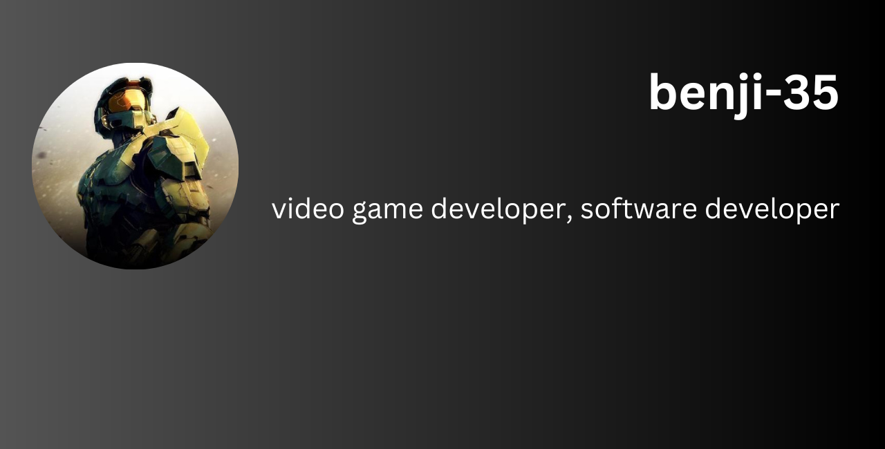

# Hi I'm benji-35 👋

I'm a student at Epitech who is interested in programming and game development.
I like to learn new things and I'm always open to new ideas.

## Current Skills

## Projects

### C Library
#### language: 
 
description: A C library that contains some functions really useful for the C language like string etc...

link: [C Library](https://github.com/benji-35/kap-CLib)

### Lego Asset
#### language:  
 
description: A unity asset that allows you to create a lego video game in a few minutes. It contains a lot of prefabs and scripts that you can use to create your own lego game, like:

- Quests system
- Vehicles driving system
- Coins system
 
etc...

link: [Lego Asset](https://github.com/benji-35/Lego-Tools-Unity-Asset)

### Gomoku
#### language: 
 
description: A Gomoku AI library that allows you to create a Gomoku AI with a few lines of code.

link: [Gomoku](https://github.com/benji-35/Gomoku)